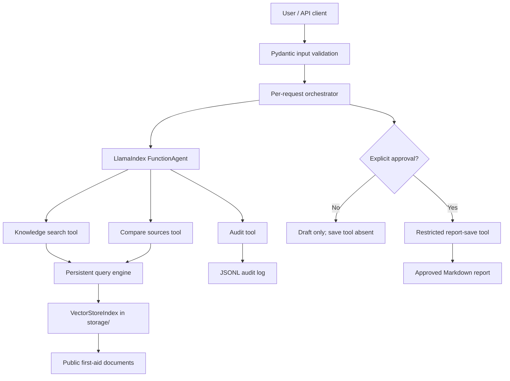

# FirstAidOps Architecture

## Trust boundaries

- User inputs are schema-validated and length-bounded.
- Retrieved document text is untrusted reference data, not instructions.
- The save tool is omitted from unapproved requests rather than merely blocked by a prompt.
- Saved names are sanitized and always resolved beneath `reports/`.
- Each request receives a fresh report identifier, approval flag, agent, and tool-call budget.
- Audit events correlate consequential actions to the report identifier.

## Termination and safety

- Tool calls are capped by `MAX_TOOL_CALLS` (default 8).
- Agent execution has a 120-second timeout.
- Parallel tool calls are disabled.
- The system prompt requires sources, limitations, confidence, and a next action.
- The system does not provide diagnosis and directs emergencies to professional services.

